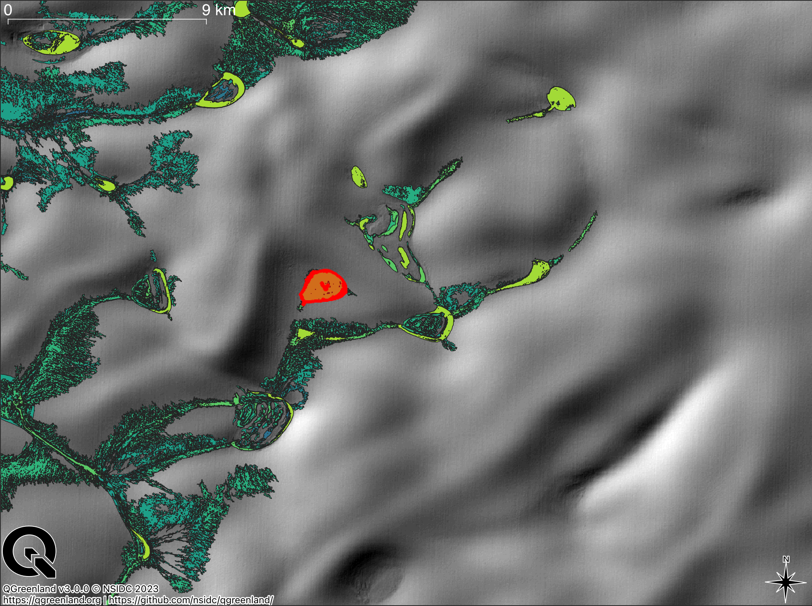

# Scope

This tool is specified to analyze the bathymetry of supraglacial lakes. It does so by loading, filtering, reviewing
and visualizing digital elevation models, i.e. the arctic digital elevation model based on an area of interest (AOI).
It takes care of loading of the digital elevation models.

# Installation

## Dependency Management with Poetry

We recommend using Poetry for dependency management. You can find the installation instructions for
Poetry [here](https://python-poetry.org/docs/#installing-with-the-official-installer).
After installing Poetry, simply run `poetry install` to install the required dependencies.
Alternatively, pip install the dependencies including all requirements in a Python>=3.9 environment.

## Data Dependencies

### Supraglacial Lakes from Sentinel-2 dataset

This tool allows the usage of user-defined geometries or the usage of the "ESA Greenland Ice Sheet CCI, Supraglacial
Lakes from Sentinel-2" dataset. The layer is called "Sermeq Kujalleq/Jakobshavn supraglacial lakes 2019" dataset.

You can find more information about the ESA CCI
product [here](http://products.esa-icesheets-cci.org/products/details/greenland_sgl_s2_20190501_20191001_jakobshavn_v1_1.zip/).
The dataset is included in this repository and can be found in the `./assets` directory.

### ArcticDEM Indexes

Currently, the only way to query the ArcticDEM dataset is by querying the respective indexes that
are stored locally. The strip index is quite large, with more than 400K strips.
You can download the indexes using the following commands:

```bash
curl -o./assets/ArcticDEM_Strip_Index_latest_gpkg.zip \
  https://data.pgc.umn.edu/elev/dem/setsm/ArcticDEM/indexes/ArcticDEM_Strip_Index_latest_gpkg.zip
unzip./assets/ArcticDEM_Strip_Index_latest_gpkg.zip -d./assets
```

```bash
curl -o./assets/ArcticDEM_Mosaic_Index_latest_gpkg.zip \
  https://data.pgc.umn.edu/elev/dem/setsm/ArcticDEM/indexes/ArcticDEM_Mosaic_Index_latest_gpkg.zip
unzip./assets/ArcticDEM_Mosaic_Index_latest_gpkg.zip -d./assets
```
ESA Greenland Ice Sheet CCI, Supraglacial Lakes from Sentinel-2 dataset can be downloaded [here](http://products.esa-icesheets-cci.org/products/download/greenland_sgl_s2_20190501_20191001_jakobshavn_v1_1.zip) and should be moved to 
`./assets/jakobshavn_supraglacial_lakes.gpgk`
# Usage

The main script in this project is ./supraglacial_lake_volumes/analyze_dems.py
The script takes in command-line arguments, loads data, performs various calculations, and generates plots and reports.
The steps of the script are:

1. Parse command-line arguments using argparse.
2. Load lake geometry and buffer size from file or default values.
3. Load DEM (Digital Elevation Model) data using DataLoader.
4. Filter DEM data based on cross-correlation with a mosaic.
5. Calculate and plot various statistics, including DEM date integrity, profiles, and differences.
6. Calculate offsets and errors between tile and raw strip data.
7. Transform raw strip data using offsets and calculate error statistics.
8. Optionally "Smooth" the transformed data.
9. Calculate and plot difference arrays and matrices.
10. Estimate lake volume and generate reports.

# Supraglacial Lake Analysis Tool

This tool is designed to facilitate the analysis of supraglacial lakes using geospatial data. It offers various
functionalities to process data, perform calculations, and visualize results related to supraglacial lake dynamics.

## Parameters

The script `./supraglacial_lake_volumes/analyze_dems.py` accepts several command-line arguments to customize the
analysis process. Below is a detailed
explanation of each parameter:

### Required Arguments

- `--lake-id`:
    - Description: Specifies the unique identifier of the supraglacial lake from a specific dataset.
    - Type: Integer
    - Required: Yes (when not using `--lake-geometry-fp`)

- `--lake-geometry-fp`:
    - Description: Path to the lake geometry file in GeoPackage format.
    - Required: Yes (when not using `--lake-id`)

### Optional Arguments

- `--date`:
    - Description: Date from the Sermeq Kujalleq/Jakobshavn supraglacial lakes 2019 dataset for which the analysis will
      be performed. Only applies if lake-id is provided as well. Will be ignored if lake-geometry-fp is provided.
    - Type: String (format: YYYY-MM-DD)
    - Default: "All"

- `--buffer-size`:
    - Description: Specifies the buffer distance around the lake geometry in meters.
    - Type: Integer
    - Default: 200 [meters]

- `--difference-matrix`:
    - Description: Calculates and plots a difference matrix.
    - Action: Store True (if provided, activates the functionality)
    - Default: False

- `--plot`:
    - Description: Enables the generation of output plots.
    - Action: Store True (if provided, activates the functionality)
    - Default: False

- `--offset-method`:
    - Description: Method to find the vertical offset with.
    - Options: "md" mean difference, "rmse" root mean square error, "linear"
    - Default: "md"

- `--smoothing-window-size`:
    - Description: Defines the N by N window size in pixels for smoothing by rolling mean of the strip DEMs and mosaic DEM.
    - Type: Integer
    - Default: None
  
- `--cc-reject`:
    - Description: Rejection threshold for the cross correlation coefficients of all strip DEMs to the reference mosaic.
    - Type: Float
    - Default: None

- `--output-dir`:
    - Description: Specifies the output directory to write the results to.
    - Type: String (directory path)
    - Default: ./results/

## Usage

To use the `main.py` script, follow the syntax below:

```bash
python main.py [--lake-id LAKE_ID | --lake-geometry-fp LAKE_GEOMETRY_FP] [--date DATE] [--buffer-size BUFFER_SIZE] [--difference-matrix] [--download] [--plot] [--smoothing-window-size SMOOTHING_WINDOW_SIZE] [--output-dir OUTPUT_DIR]
```

Replace the placeholders with appropriate values for your analysis.

## Examples

1. Analyze a supraglacial lake using its ID and plot data:
   The red polygon in the figure belows shows the extent of lake with ID 193456 on the 11th August 2019.
   

```bash
python ./supraglacial_lake_volumes/analyze_dems.py --lake-id 193456 --date 2019-08-11 --plot
```

2. Perform analysis using a lake geometry file, specify buffer size:

```bash
python ./supraglacial_lake_volumes/analyze_dems.py --lake-geometry-fp /path/to/lake_geometry.gpkg --buffer-size 200
```

# Outputs

As mentioned above, the user can define whether he wants to generate plots or not. By default this tool generates
reports in the
form of csv files. as well as intermediate

```
.
├── {lake_id}_estimated_lake_volumes.csv # 
├── {lake_id}_report.csv 
├── geometry_date_{date}.gpkg 
├── overlapping_strips_buffer_{buffer}.gpkg
└── plots
    ├── all_dates_lake_masked.jpg
    ├── cross_correlation.jpg
    ├── difference_to_mosaic.jpg
    ├── profiles_raw.jpg
    └── profiles_transformed.jpg
```

### Geometries

querying the strip index can take up some time so the resulting query shapes (geopandas geodataframe)
will be saved in the output directory as a geopackage `overlapping_strips_buffer_{buffer}.gpkg`.
For debugging and visualizations in other geographic information systems, the query polygons, i.e lakes are
stored as well as `geometry_date_{date}.gpkg`.

### Statistics

`{lake_id}_report.csv` contains error and quality measures

### Plots

* `all_dates_lake_masked.jpg`: serves as a first visualization of the digital elevation model,
  masked by the lake geometry.
* `cross_correlation.jpg`: the cross correlation heatmap to assess the quality of a set of DEMs after they've
  been filtered by a cross correlation coefficient value threshold (the default is defined above). The threshold is
  applied on the coefficient value to the reference mosaic. This plot can less readable if there are more than 30
  DEMs ("dates")
* `profiles_raw.jpg`: Pixel values of all selected DEMs along two Profile lines A) and B).
* `profiles_transformed.jpg`: Same plot as above after the vertical d_z transformation
* `difference_to_mosaic.jpg`: To make the plots more robust to outliers, the values are clipped by a minimum of -4
  meters and maximum of 4 meters
### Demo Results
Demo results can be found in `./demo/` 
They were produced by using the hand-drawn lake extent polygon  `./assets/test_sgl_08052024.gpkg`